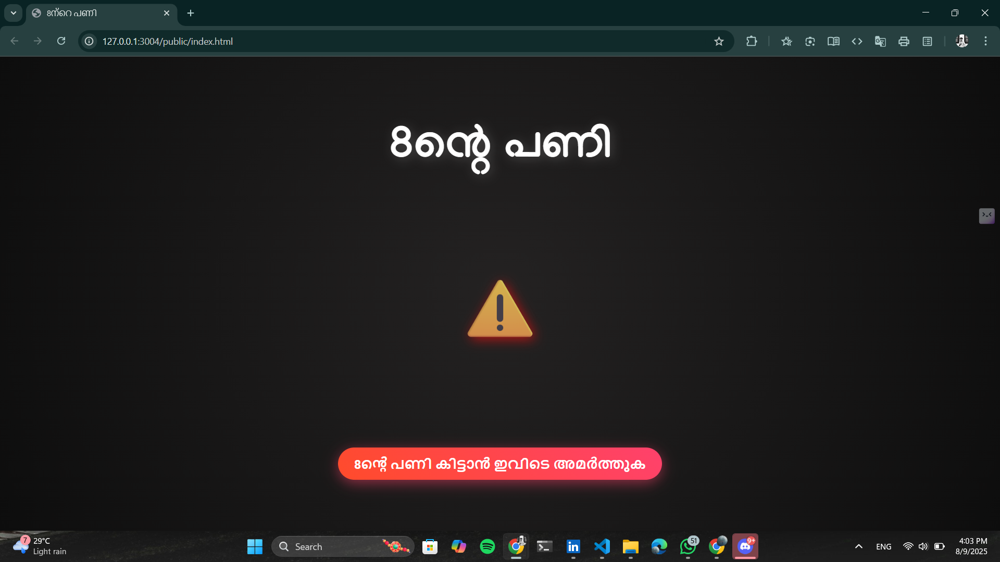
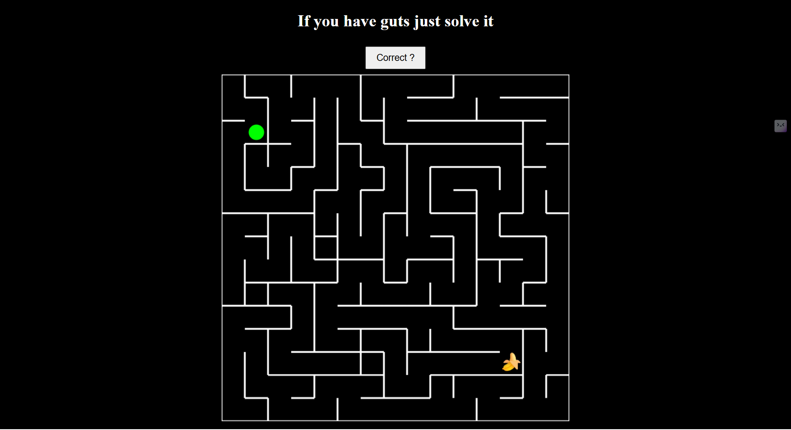

# 8ൻ്റെ പണി🎯

## Basic Details
### Team Name: TechNova

### Team Members
- Member 1: Anfas Rahman T R - College Of Engineering Thalassery
- Member 2: Ardra p -College Of Engineering Thalassery

### Project Description
A playful prank web app that wastes your time in the most creative ways possible.
Click the "8ൻ്റെ പണി കിട്ടാൻ ഇവിടെ അമർത്തുക" button and you might:

### The Problem (that doesn't exist)
[What ridiculous problem are you solving?]

### The Solution (that nobody asked for)
[How are you solving it? Keep it fun!]

## Technical Details
### Technologies/Components Used
For Software:
- Languages used are HTML5,CSS3 and JavaScript.
- No heavy JS frameworks everything is plain JavaScript.

### Implementation
For Software:
# Installation
[commands]

# Run
[commands]

### Project Documentation
For Software:
1.Code Editors / IDEs: Visual Studio Code

2.Version Control: Git (to track changes), GitHub

# Screenshots (Add at least 3)

Home page

Funny game

*Add caption explaining what this shows*

# Diagrams

*Add caption explaining your workflow*

For Hardware:

# Schematic & Circuit

*Add caption explaining connections*

*Add caption explaining the schematic*

# Build Photos

*List out all components shown*

*Explain the build steps*

*Explain the final build*

### Project Demo
# Video
[Add your demo video link here]
*Explain what the video demonstrates*

# Additional Demos
[Add any extra demo materials/links]

## Team Contributions
- [Name 1]: [Specific contributions]
- [Name 2]: [Specific contributions]
- [Name 3]: [Specific contributions]

---
Made with ❤️ at TinkerHub Useless Projects 

